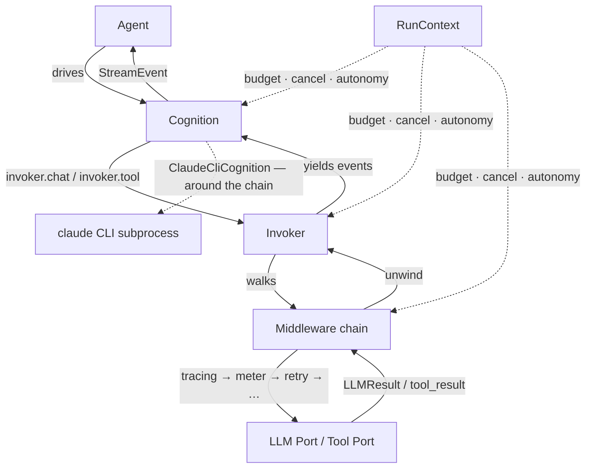

**agentkit is a low-level framework for building AI agents in Python.**
It gives you the parts an agent loop is made of — the decision step, the
spend ceiling, the approval gate, the crash-recovery snapshot, the
middleware chain — as typed, swappable pieces, and then gets out of the
way. It does not ship personas, a graph DSL, or a hosted runtime.

It is for people whose agent has to keep running when nobody is
watching. If you are sketching in a notebook, most of what is below is
ceremony you do not need yet.

## The pain

You've written an agent. It ran. Then one of these happened.

Your agent looped 40 times against a model that thought the tool was
succeeding. The bill was $217. There was no ceiling.

Your researcher agent errored halfway through a 20-minute run. The
worker died with the transcript in memory. You restarted from zero.

Your tool called `git push --force` on `main` because there was no
approval gate. Nobody was watching. Your teammate lost a day.

Each of these is a line of wiring in agentkit:

| What went wrong | The line |
|---|---|
| No spend ceiling | `Budget(max_cost_usd=5.0)` on the `RunContext` — plus `meter()` in the chat chain, which is what charges it |
| Worker died mid-run | `Checkpointer(port=...)` — `ReActCognition` snapshots after each successful tool iteration; a fresh process resumes the same `run_id` |
| Tool mutated the world unattended | `autonomy="gated"` on the run + `@tool(side_effecting=True)` — the loop suspends and hands control to a human |

None of the three is hidden. Each is a value you pass, on an object you
constructed, that you can read the source of.

## What it looks like

An agent with a tool, a spend ceiling, and no API key. This runs on a
bare `pip install arc-agentkit`.

```python
import asyncio

from agentkit import Agent, Budget, ToolCall, tool
from agentkit.agents.cognition import ReActCognition
from agentkit.middlewares import meter
from agentkit.testing import FakeLLM, Turn, make_test_ctx


@tool(side_effecting=False)
async def search(query: str) -> str:
    """Search the literature for `query`. Returns bulleted hits with source and year."""
    return "- 'Distributed cognition in cephalopods' (science.org, 2023)"


async def main() -> None:
    # A scripted stand-in for the model: turn 1 asks for the tool, turn 2 answers.
    llm = FakeLLM.script([
        Turn(tool_calls=(ToolCall("c1", "search", {"query": "octopus cognition"}),)),
        Turn(content="Octopuses distribute cognition across their arms."),
    ])
    ctx = make_test_ctx(
        llm=llm,
        budget=Budget(max_cost_usd=5.0),
        chat_middleware=[meter()],
    )

    agent = Agent(
        name="briefer",
        model="claude-sonnet-4-6",
        prompt="Research the question with `search`, then answer in one sentence.",
        cognition=ReActCognition(tools=[search]),
    )
    result = await agent.run("What do we know about octopus cognition?", ctx)

    print(result.output)
    print(f"spent ${ctx.budget.spent_usd:.4f} of ${ctx.budget.max_cost_usd} "
          f"over {ctx.budget.calls} calls")


if __name__ == "__main__":
    asyncio.run(main())
```

```text
Octopuses distribute cognition across their arms.
spent $0.0002 of $5.0 over 2 calls
```

Swap `FakeLLM` for `providers.claude(api_key=...)` and nothing else in
the script changes — the `Agent`, the cognition, the tool and the
middleware chain are all unaware of which provider is underneath.
[Getting started](getting-started.md) shows that wiring.

## What you'll actually use

The map from "what I want to do" to "which primitive fills that slot".
Every row is a slot in the same composition — the right-hand column is
how you fill it, not what agentkit forces on you.

It is five short tables rather than one long one. A single list of
twenty rows is a list nobody reads past the eighth, and the row you
needed is always further down than that.

### Decide the next step

| You want to&nbsp;…                                            | Reach for&nbsp;…                                            |
|---------------------------------------------------------------|-------------------------------------------------------------|
| Wire one LLM call with retry / cost / trace on top            | `Chat` (from `claude()` / `openai()` / `deepseek()` / `openrouter()`) |
| Build an agent that loops through tools                       | `Agent` + `ReActCognition`                                  |
| Delegate the whole loop to a local `claude` CLI               | `Agent` + `ClaudeCliCognition`                              |
| …or to a local `codex` CLI, contained by an OS sandbox        | `Agent` + `CodexCliCognition(sandbox=...)`                  |
| Orchestrate many child agents                                 | `Agent` + `CoordinatorCognition`                            |
| A fixed multi-step pipeline (author writes the plan)          | `Workflow`                                                  |
| One pipeline step whose width you only learn at runtime       | `Workflow.map(name, over=..., each=...)`                    |
| Package prompt + cognition + tools + memory as one unit       | `Skill` (`.as_agent()` / `.as_tool()`)                      |

### Keep the run inside its limits

| You want to&nbsp;…                                            | Reach for&nbsp;…                                            |
|---------------------------------------------------------------|-------------------------------------------------------------|
| Pause a tool for human approval                               | `Autonomy.GATED` on the `RunContext` + `Suspended` / `Agent.resume()` |
| Cap what the run can spend                                    | `Budget(max_cost_usd=...)` / `Quota(max_rpm=..., max_usd=...)` |
| Survive a worker crash                                        | `Checkpointer(port=...)`                                    |
| Stop retrying a step that keeps failing the same way          | `attempt_until_stuck(fn, fingerprint=...)` → `Stuck`        |
| Add a cross-cutting concern (tracing, retry, guardrail)       | Middleware in the `chain([...])` on the `Invoker`           |

### Reach outside the process

| You want to&nbsp;…                                            | Reach for&nbsp;…                                            |
|---------------------------------------------------------------|-------------------------------------------------------------|
| Consume an MCP server's tools                                 | `MCPClient` + `mcp_tools()`                                 |
| Let the `claude` CLI call the tools you already wrote         | `serve_registry(registry, name=..., ctx=...)` → `spec.cli_kwargs()` |
| …or the `codex` CLI, which reads the same server as TOML      | `spec.codex_kwargs()` / `as_codex_mcp(spec)`                |
| Send the CLI's permission prompts to your reviewer, and keep what they decided | `ApprovalServer(asker=...)` → `.cli_kwargs()` / `.decisions` |
| Make your tool middleware reach the CLI's own `Write` / `Bash` | `hook_settings(middleware=..., ctx=..., tools=...)`         |

### Give it something to know

| You want to&nbsp;…                                            | Reach for&nbsp;…                                            |
|---------------------------------------------------------------|-------------------------------------------------------------|
| Ground an answer in retrieved facts                           | A `MemorySource` (`VectorMemory` / `FileMemory` / …) + `as_grounder()` |
| Ask several sources at once without reading one fact twice    | `CompositeMemory(sources, dedupe="id")`                     |

### Prove it works without spending

| You want to&nbsp;…                                            | Reach for&nbsp;…                                            |
|---------------------------------------------------------------|-------------------------------------------------------------|
| Unit-test an agent end to end with no API key                 | `agentkit.testing` — `FakeLLM` + `make_test_ctx(...)`       |
| Do the same for the `claude` CLI path, offline and free       | `FakeClaudeCli.script([...])` + `ClaudeCliCognition(spawn=...)` |
| …and for the `codex` one                                      | `FakeCodexCli.script(codex_turn(...))` + `CodexCliCognition(spawn=...)` |

Three rows in "reach outside the process" are one story. The CLI owns
its loop, so anything you want it to respect — your tools, your
reviewer, your guardrails — has to reach it as configuration before it
starts. [The Claude CLI](concepts/claude-cli.md) walks those seams;
[Integrations](concepts/integrations.md) has the two MCP servers in
full. [The Codex CLI](concepts/codex-cli.md) is the same argument for
the other binary — and covers the two of those seams Codex simply does
not have, rather than leaving you to look.

## The run in one picture



Nothing on the solid path is optional. Nothing on it is a class you
can't rewrite.

The dashed edge on the right is the one exception, and it is worth
knowing before you take it. `ClaudeCliCognition` hands the loop to a
subprocess, so when the CLI runs one of its *own* tools — `Write`,
`Bash`, `WebFetch` — the call never walks your `Invoker`. Budget
charging is patched onto that path by hand; nothing else in the chain
is, so an `egress` guard you wired and documented does not run. The
cognition warns and names the middlewares that stopped applying, and
[The Claude CLI](concepts/claude-cli.md) covers the three ways to close
the gap — including `hook_settings`, which makes the chain apply again.

## What agentkit deliberately does not do

Frameworks make different bets, and the honest way to pick one is to
know what it refuses.

- **No visual graph.** The loop is Python, not a DAG you draw. If a
  diagram your ops team can review is the requirement, LangGraph is the
  better fit.
- **No hosted runtime, no built-in personas, no one-click deploy.**
  agentkit runs where your Python runs and ships no "researcher" agent
  with a prompt in it. It is the runtime, not the product.
- **No large integration catalog.** LangChain has far more pre-glued
  connectors today. agentkit ships fewer, on purpose, and gives you the
  `Protocol` to write yours.
- **Nothing that pays off in a notebook.** Typed seams, cancellation,
  budgets and checkpointing cost you ceremony up front and only repay
  it when the code has to keep running under real load.

[Why agentkit](why.md) makes the positive case in full: sixteen concrete
guarantees and a side-by-side against the alternatives.

## Where to go next

<div class="grid cards" markdown>

-   __Getting started__

    ---

    Install, extras, and a first agent that runs offline in five
    minutes — then the same agent against a real provider.

    [:octicons-arrow-right-24: Install and run something](getting-started.md)

-   __Tutorial__

    ---

    Six steps, one script each. Builds one research-briefing agent
    from a single call to a gated tool a human has to approve. Steps
    1–5 need no API key.

    [:octicons-arrow-right-24: Start the tutorial](tutorial.md)

-   __Glossary__

    ---

    Every term these docs use, defined in one sentence of plain English
    — *cognition*, *port*, *middleware*, *grounding*, *ReAct*. Start
    here if the vocabulary is the thing slowing you down.

    [:octicons-arrow-right-24: Read the glossary](glossary.md)

-   __Cheatsheet__

    ---

    Every primitive, tight code, skimmable in 90 seconds. Reach for it
    when you know what you want and just need the invocation.

    [:octicons-arrow-right-24: Open the cheatsheet](cheatsheet.md)

-   __Recipes__

    ---

    Problem-first answers to "how do I X?" — cap spend, pause for a
    human, survive a crash, wire OpenTelemetry, consume MCP, use the
    local `claude` CLI.

    [:octicons-arrow-right-24: Browse the recipes](recipes/index.md)

-   __The Claude CLI__

    ---

    One of the two loops your code does not own. What
    `ClaudeCliCognition` gives away, which of your middlewares stop
    applying when it does, and the five seams — MCP tools, approvals,
    hooks, sub-agents, a test double — that reach back into it.

    [:octicons-arrow-right-24: Delegate to the CLI safely](concepts/claude-cli.md)

-   __The Codex CLI__

    ---

    The other one. Same contract, four real differences — containment
    is an OS sandbox rather than a tool list, there is no
    system-prompt flag, the CLI reports no cost, and a session resumes
    a thread instead of holding a process.

    [:octicons-arrow-right-24: Read the differences](concepts/codex-cli.md)

-   __Worked scenarios__

    ---

    Four end-to-end designs — multi-tenant chat over documents, an
    autonomous devops investigator, long-running data enrichment, and
    coordinated multi-agent research — each tracing which primitives
    carry which requirement.

    [:octicons-arrow-right-24: Read the mental models](mental-models/README.md)

-   __Runnable examples__

    ---

    Six scripts you can execute from a clone, each showing one seam:
    streaming, tools, typed output, budgets, checkpoints, coordination.

    [:octicons-arrow-right-24: Run the examples](examples.md)

-   __Coming from something else__

    ---

    Side-by-side translations from LangChain and from hand-rolled
    `asyncio`, showing what the framework takes over and what it leaves
    to you.

    [:octicons-arrow-right-24: See the migration guides](migrating/index.md)

</div>

Contributions and bug reports are welcome — see
[contributing](contributing.md) for the local gate (`make check`) and
what a good change looks like here.
