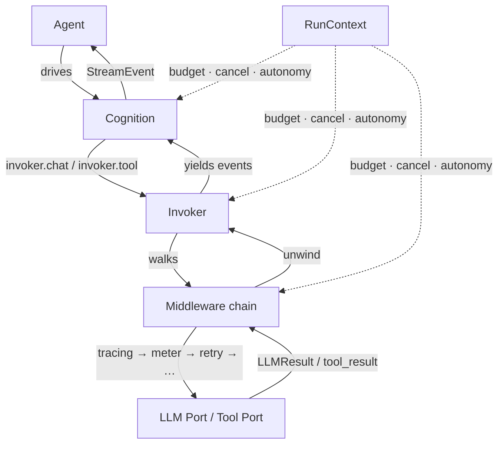

## The pain

You've written an agent. It ran. Then one of these happened.

Your agent looped 40 times against a model that thought the tool was
succeeding. The bill was $217. There was no ceiling.

Your researcher agent errored halfway through a 20-minute run. The
worker died with the transcript in memory. You restarted from zero.

Your tool called `git push --force` on `main` because there was no
approval gate. Nobody was watching. Your teammate lost a day.

**agentkit is a low-level framework that makes each of these a
one-line fix.** `Budget(max_cost_usd=5.0)` halts the run before it
overspends. `Checkpointer(port=...)` snapshots after every tool
iteration so a fresh worker picks up where the last one died.
`autonomy="gated"` on the run suspends before every side-effecting
tool and hands control to a human. Nothing is hidden. Every seam is
a typed Protocol you can swap.

## What you'll actually use

Ontology before tutorial. When you sit down to write, this is the
map from "what I want to do" to "which primitive fills that slot."

| You want to&nbsp;…                                            | Reach for&nbsp;…                                            |
|---------------------------------------------------------------|-------------------------------------------------------------|
| Wire one LLM call with retry / cost / trace on top            | `Chat` (from `claude()` / `openai()` / `deepseek()` / `openrouter()`) |
| Build an agent that loops through tools                       | `Agent` + `ReActCognition`                                  |
| Delegate the whole loop to a local `claude` CLI               | `Agent` + `ClaudeCliCognition`                              |
| Orchestrate many child agents                                 | `Agent` + `CoordinatorCognition`                            |
| A fixed multi-step pipeline (author writes the plan)          | `Workflow`                                                  |
| Package prompt + cognition + tools + memory as one unit       | `Skill` (`.as_agent()` / `.as_tool()`)                      |
| Consume an MCP server's tools                                 | `MCPClient` + `mcp_tools()`                                 |
| Pause a tool for human approval                               | `Autonomy.GATED` on the `RunContext` + `Suspended` / `Agent.resume()` |
| Cap what the run can spend                                    | `Budget(max_cost_usd=...)` / `Quota(max_rpm=..., max_usd=...)` |
| Survive a worker crash                                        | `Checkpointer(port=...)`                                    |
| Add a cross-cutting concern (tracing, retry, guardrail)       | Middleware in the `chain([...])` on the `Invoker`           |

Every row is a slot in the same composition — the primitives on
the right are how you fill it, not what agentkit forces you into.

## What changes with agentkit

- **Budget halts the run cleanly** on overrun — `MeterExceeded`
  propagates, the loop unwinds, no over-spend.
- **Checkpointer survives worker crashes** — a fresh process resumes
  from the last snapshot on the same `run_id`.
- **Autonomy tier gates every side-effecting tool** — a human
  approves before mutation happens.
- **Cancel propagates through the subtree** — cancel the parent,
  every child stops at its next `check_cancelled`.
- **The middleware chain intercepts every LLM and tool call in one
  line** — `tracing`, `retry`, `meter`, `memoize`, `compaction`,
  `security` — swap or reorder by editing a list.
- **Every seam is a typed Protocol** — swap the LLM, the store, the
  checkpoint backend, the tracer without editing the loop.

## The four themes

Every concept in agentkit falls into one of four orthogonal buckets.
Learn these four; the rest is which class fills which slot.

<div class="grid cards" markdown>

-   __Cognition__

    ---

    How the agent decides the next step. `SingleCallCognition`,
    `ReActCognition`, `CoordinatorCognition`, `ClaudeCliCognition`,
    or your own `Cognition` Protocol impl.

    [:octicons-arrow-right-24: Concepts › Agents](concepts/agents.md)

-   __Control__

    ---

    What limits the agent's authority. `Autonomy`, `Budget`, `Quota`,
    `CancellationToken`, `RunPolicy`, `Suspended` + `resume()` for
    HITL.

    [:octicons-arrow-right-24: Concepts › Runtime](concepts/runtime.md)

-   __State__

    ---

    What the agent knows. `WorkingContext`, `MemorySource`
    (`VectorMemory` / `JournalMemory` / `FileMemory` /
    `ScratchpadMemory`), `Prompt`, `Checkpointer`.

    [:octicons-arrow-right-24: Concepts › Capabilities](concepts/capabilities.md)

-   __Behaviour__

    ---

    How every call is intercepted. The middleware chain (`tracing`,
    `retry`, `meter`, `compaction`, `security`, `output_coerce`, …)
    and capabilities (`RequestBuilder`, `Compactor`, `Guardrail`).

    [:octicons-arrow-right-24: Concepts › Middlewares](concepts/middlewares.md)

</div>

**Adapters** — `claude()` / `openai()` / `deepseek()` /
`openrouter()` presets, `ClaudeCliCognition`, `MCPClient`, and any
`LLMPort` you write — are **plug-ins**, not the point. They fill the
LLM slot in a composition; the composition is what agentkit is
about.

## First runnable example

An `Agent` with a `ReActCognition`, one tool, and a `RunContext`.
The LLM plug-in is swappable — pick whichever tab fits how you'll
actually deploy.

=== "Local CLI (no API key)"

    ```python
    """Requires the `claude` CLI on PATH and one prior `claude login`.
    Zero API keys; the CLI's own auth is used.

    Install: https://docs.claude.com/en/docs/claude-code
    """

    import asyncio

    from agentkit import Agent, Scope
    from agentkit.agents.cognition import ClaudeCliCognition
    from agentkit.runtime import RunContext, Services


    async def main() -> None:
        agent = Agent(
            name="briefer",
            prompt="Answer in one short sentence.",
            cognition=ClaudeCliCognition(model="claude-sonnet-4-6"),
        )
        ctx = RunContext(correlation_id="run-1", scope=Scope(), services=Services())

        result = await agent.run("What do we know about octopus cognition?", ctx)
        print(result.output)
        print(f"cost estimate: ${result.usage.cost_usd:.4f}")

        # Expected (real answer varies):
        #   Octopuses appear to plan, use tools, and solve mazes.
        #   cost estimate: $0.0031


    if __name__ == "__main__":
        asyncio.run(main())
    ```

=== "Anthropic API key"

    ```python
    """Requires `pip install "arc-agentkit[http]"` and ANTHROPIC_API_KEY.
    Same shape; the LLM plug-in is a different one."""

    import asyncio
    import os

    from agentkit import Agent, Scope, Services, RunContext
    from agentkit.adapters.llm import providers
    from agentkit.runtime import Invoker
    from agentkit.middlewares import meter, retry, tracing


    async def main() -> None:
        llm = providers.claude(api_key=os.environ["ANTHROPIC_API_KEY"],
                               model="claude-sonnet-4-6")
        services = Services(
            invoker=Invoker(llm=llm, chat_middleware=[tracing(), meter(), retry()]),
        )
        ctx = RunContext(correlation_id="run-1", scope=Scope(), services=services)

        agent = Agent(
            name="briefer",
            model="claude-sonnet-4-6",
            prompt="Answer in one short sentence.",
        )
        result = await agent.run("What do we know about octopus cognition?", ctx)
        print(result.output)
        print(f"cost: ${result.usage.cost_usd:.4f}")


    if __name__ == "__main__":
        asyncio.run(main())
    ```

=== "OpenAI API key"

    ```python
    """Requires `pip install "arc-agentkit[http]"` and OPENAI_API_KEY.
    Same shape; the LLM plug-in is a different one."""

    import asyncio
    import os

    from agentkit import Agent, Scope, Services, RunContext
    from agentkit.adapters.llm import providers
    from agentkit.runtime import Invoker
    from agentkit.middlewares import meter, retry, tracing


    async def main() -> None:
        llm = providers.openai(api_key=os.environ["OPENAI_API_KEY"],
                               model="gpt-4o-mini")
        services = Services(
            invoker=Invoker(llm=llm, chat_middleware=[tracing(), meter(), retry()]),
        )
        ctx = RunContext(correlation_id="run-1", scope=Scope(), services=services)

        agent = Agent(
            name="briefer",
            model="gpt-4o-mini",
            prompt="Answer in one short sentence.",
        )
        result = await agent.run("What do we know about octopus cognition?", ctx)
        print(result.output)
        print(f"cost: ${result.usage.cost_usd:.4f}")


    if __name__ == "__main__":
        asyncio.run(main())
    ```

Swap the LLM plug-in without touching the `Agent`, the cognition, or
the middleware chain. That's the framework's central bet: composition
over the loop.

## The run in one picture



Nothing in the picture is optional. Nothing in the picture is a
class you can't rewrite.

## Where to go next

<div class="grid cards" markdown>

-   __Tutorial__

    ---

    Fifteen minutes, five steps, one runnable script per step — from
    a single chat call to a gated tool the human has to approve.

    [:octicons-arrow-right-24: Start the tutorial](tutorial.md)

-   __Cheatsheet__

    ---

    Every primitive, tight code, skimmable in 90 seconds. Reach for
    it when you know what you want and just need the invocation.

    [:octicons-arrow-right-24: Open the cheatsheet](cheatsheet.md)

-   __Recipes__

    ---

    Problem-first answers to "how do I X?" — cap spend, pause for a
    human, survive a crash, wire OpenTelemetry, consume MCP, use the
    local `claude` CLI.

    [:octicons-arrow-right-24: Browse the recipes](recipes/index.md)

</div>

## When agentkit is (probably) not the fit

Frameworks make different bets. Pick the one whose bet matches
yours.

- **You want a visual graph you can draw** — reach for LangGraph
  instead. agentkit's loop is Python, not a DAG.
- **You want a batteries-included agent product** — hosted memory,
  built-in personas, one-click deploy — reach for a hosted framework
  like OpenAI Assistants or a managed offering. agentkit is the
  runtime, not the product.
- **You want to prototype in a notebook and never leave** —
  anything works, and agentkit's benefits (typed seams, cancel,
  budget, checkpointing) only start paying off when the code has to
  keep running under real load.

See [Why agentkit](why.md) for the twelve concrete guarantees and a
side-by-side comparison with the alternatives.
